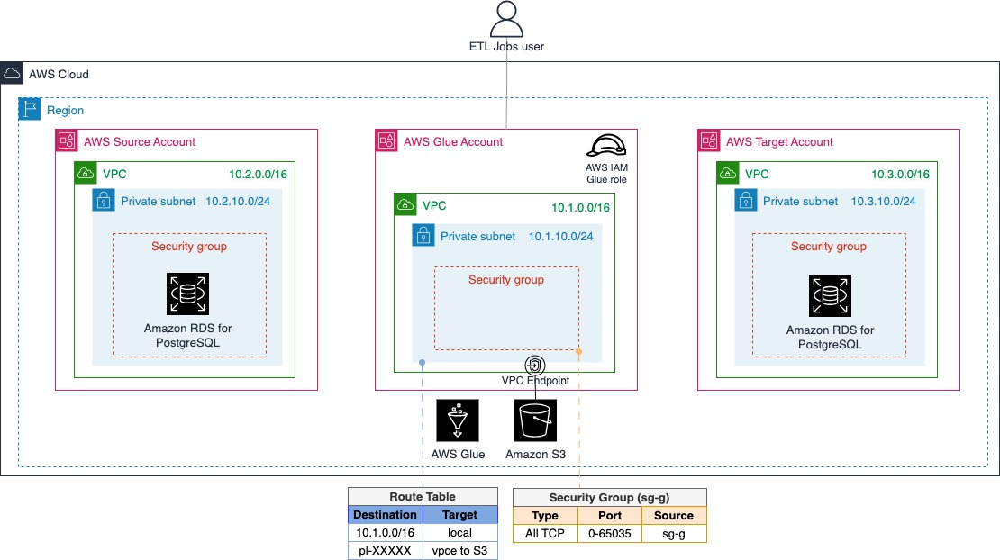

# Copy and scrub PII between Amazon RDS databases using visual ETL jobs in AWS Glue Studio

This repository is an accompaniment to the blog post __Copy and scrub PII between Amazon RDS databases using visual ETL jobs in AWS Glue Studio__.

The artifacts in this repository will help you complete the **Prerequisites** highlighted in the blog post. 


## Requirements

Before leveraging the artifacts in this repository, you need:

1. Three AWS accounts: Source, Glue and Target.
2. Ensure your AWS user has permissions to create and manage the necessary AWS resources for the solution on the three AWS accounts.


## Artifacts Overview

At a glance, the artifacts provided are [AWS CloudFormation](https://docs.aws.amazon.com/AWSCloudFormation/latest/UserGuide/Welcome.html) templates, shell scripts and files with SQL statements.


### AWS CloudFormation templates

These teamplates are provided in the `clouformation` directory.


#### `cf-prerequisites.yml`

This template provisions AWS components in Source, Glue and Target accounts as per the Prerequisites in the blog post. 

After deploying this stack on each account, your environment will look like as shown on the diagram below:





In addition to the components shown in the diagram, the CloudFormation stack creates an [Amazon Cloud9](https://docs.aws.amazon.com/cloud9/latest/user-guide/welcome.html) environment in both **Source** and **Target accounts**. The purpose of these Amazon Cloud9 environments is to act as **bastion host**, so you can create and access the `customer` table on the Amazon RDS PostgreSQL databases.


#### `cf_aws_cloud9_ssm_roles.yml`

This AWS CloudFormation template creates the AWS IAM roles that enable [AWS Systems Manager](https://docs.aws.amazon.com/systems-manager/latest/userguide/what-is-systems-manager.html) to manage the EC2 instance that backs the Amazon Cloud9 environment.

You will need this CloudFormation template **only if** you have **not** previously provisioned an Amazon Cloud9 on the Source and/or Target accounts.


### Shell scripts

These are all provided in `scripts` directory.


- **`cloud9-AL2023-setup.sh`**: This is a simple shell script to help you install the PostgreSQL client on the Amazon Cloud9 environments.

- **`connect_to_database.sh`**: This shell script helps you connect to the Amazon RDS PostgreSQL database provisioned on the AWS account where you run the script.


### SQL statement files

These are all provided in `sql` directory.

- **`create_database_table.sql`**: Contains the SQL statements to create the `customer` table and `cx` schema. 

- **`insert_source_data.sql`**: Contains the SQL statements to populate the `customer` table on the **Source database**.


## Walkthrough

Complete the following steps:

1. Prepare the AWS Source account
2. Prepare the dedicated AWS Glue account
3. Prepare the AWS Target account


### Step 1: Prepare the AWS Source account


Complete the following steps:

1. Launch the AWS CloudFormation template
2. Configure the _Bastion Host_ (Amazon Cloud9)
3. Create and populate the `customer` database table


The following resources will be provisioned as part of the AWS CloudFormation `cf-prerequisites.yml` template launch:

1. Amazon **VPC**
2. **Amazon RDS for PostgreSQL** database instance
3. Two **private subnets** for the Amazon RDS database
4. A **subnet group** for the Amazon RDS database that groups the two private subnets
5. A **route table** for the subnets
6. A **security group** for the database
7. **Amazon Cloud9 environment** (Bastion Host)
8. A **public subnet** for the bastion host


> [!IMPORTANT]
> If you have not previously provisioned an **Amazon Cloud9** on this AWS account, launch the CloudFormation template `cf_aws_cloud9_ssm_roles.yml` first. 


#### 1. Launch the `cf-prerequisites.yml` AWS CloudFormation template:


1. Download and unzip this GitHub repository, or use a git client to clone the project GitHub repository to a local directory.
2. Log into the [AWS Console](https://console.aws.amazon.com/) with your **AWS Source account**.
3. Navigate to **CloudFormation**.
4. Choose **Create stack with new resources (standard)**.
5. Choose **Choose an existing template** and **Upload a template file**.
6. Select **Choose file** and upload the `cf-prerequisites.yml` in your local project `cloudformation` directory.
7. Enter a stack **name** (i.e. `SourceAccount-stack`)
8. In **Parameters** section:
  - Select `Source` for **AccountType**
  - In **DBMasterUserPassword**, enter a password for the database. 
9. Review the rest of parameters and choose **Next**.
10. In **Review and create**, click the check box **I acknowledge that AWS CloudFormation might create IAM resources with custom names**. Then choose **Submit**.

It will take ~10 minutes to complete.

> [!TIP]
> Once you've created the AWS CloudFormation stack, review the information on the **Outputs** pane of the stack on the CloudFormation Console.
> You will need some of the values, such as **`VPC`**, **`RDSSecurityGroup`**, private subnets (**`PrivateSubnet`** and **`PrivateSubnetB`** ) and **`RDSJdbcURL`**.


#### 2. Configure the _Bastion Host_ (Amazon Cloud9):

1. On the **AWS Console**, navigate to **Cloud9**.
2. Select the Cloud9 environment, then choose **Open in Cloud9**.
3. In the environment, upload the artifacts in your local project `scripts` directory.
4. Then open a window terminal and run the following commands:

```bash
chmod 755 ./cloud9-AL2023-setup.sh
./cloud9-AL2023-setup.sh
```

This will install PostgreSQL client on the environment.


#### 3. Create and populate the `customer` database table:

In the **Cloud9 environment**, upload the artifacts in your local project `sql` directory.

Then run the following commands:

```bash
chmod 755 ./connect_to_database.sh
./connect_to_database.sh
```

Enter the **password** to connect to the database. This is the password you provided when launching the CloudFormation stack.

You are now connected to the database. Run the following command to **create** the `customer` table:

```sql
\i create_database_table.sql
```

and to **populate** the table:


```sql
\i insert_source_data.sql
```

To verify the rows have been inserted:

```sql
select * from cx.customer;
```


### Step 2: Prepare the dedicated AWS Glue account

The following resources will be provisioned as part of the CloudFormation template launch:

1. Amazon VPC
2. A private subnet
3. A route table for the private subnet
4. A security group with a self-referencing inbound rule
5. The AWS Identity and Access Management (IAM) service role for AWS Glue. 
6. An Amazon S3 endpoint associated with the route table 


To launch the cf-prerequisites.yml` **AWS CloudFormation** template:

1. Download and unzip this GitHub repository, or use a git client to clone the project GitHub repository to a local directory.
2. Log into the **AWS Console** with your **AWS Glue account**.
3. Navigate to **CloudFormation**.
4. Choose **Create stack with new resources (standard)**.
5. Choose **Choose an existing template** and **Upload a template file**.
6. Select **Choose file** and upload the `cf-prerequisites.yml` in your local project `cloudformation` directory.
7. Enter a stack **name** (i.e. “GlueAccount-stack”)
8. In Parameters, select `Glue` for **AccountType**.
9. Review the rest of parameters and choose **Next**.
10. In **Review and create**, click the check box "I acknowledge that AWS CloudFormation might create IAM resources with custom names". Then choose **Submit**.

It will take ~1 minute to complete.

> [!TIP]
> Once you've created the AWS CloudFormation stack, review the fields shown on the **Outputs** pane of the stack on the Cloudformation Console.
> You will need some of the values such as **VPC**, **GlueSecurityGroup**, **PrivateSubnet** and **GlueServiceIAMRole**.


### Step 3: Prepare the AWS Target account


To setup the **Target account**, log into the AWS Console with your **AWS Target account** and repeat the steps you followed when setting up the Source account. 

The resources provisioned as part of the CloudFormation template launch, will be the same as for the Source account.

- When launching the CloudFormation template:

1. Name the stack i.e. `TargetAccount-Stack`
2. In **Paramters** section, 
   a. Select `Target` for **AccountType** parameter, and 
   b. enter the **database password** you would like to use.

- After creating the database table, do **NOT** run the insert SQL statements on `insert_source_data.sql` script.


And that's it! Your environment meets now the prerequisites to proceed with the blog post solution.


## Cleanup resources

Don't forget to clean up all the AWS resources you created. It is a best practice to delete resources you are no longer using to avoid unwanted charges.

To delete the resources:

On the **AWS Source** account:
- Navigate to the CloudFormation dashboard in the AWS Management Console and delete the `SourceAccount-stack`.

On the **AWS Glue** account:
- Navigate to the CloudFormation dashboard in the AWS Management Console and delete the `GlueAccount-stack`.

On the **AWS Target** account:
- Navigate to the CloudFormation dashboard in the AWS Management Console and delete the `TargetAccount-stack`.

## Security

See [CONTRIBUTING](CONTRIBUTING.md#security-issue-notifications) for more information.

## License

This library is licensed under the MIT-0 License. See the LICENSE file.

